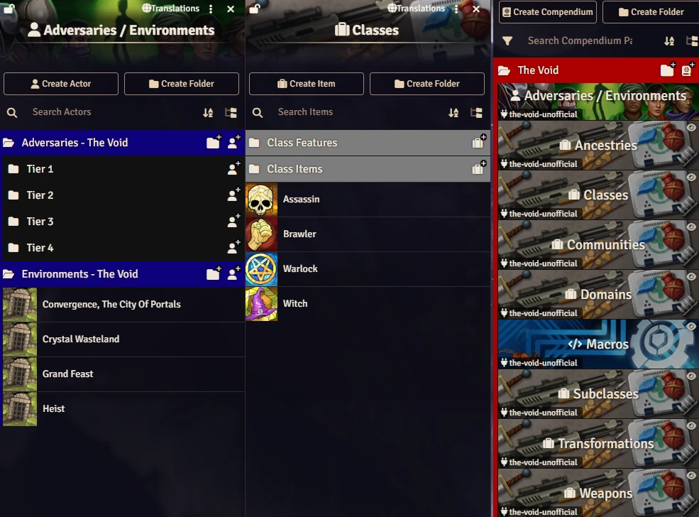

# Daggerheart - The Void (Unofficial)
This module is not official. This is a fanmade work.

The content in this module is from [https://www.daggerheart.com/thevoid/](https://www.daggerheart.com/thevoid/).

<p align="center">
  
</p>

# Manual Instalation

Go to **modules** and paste the link. 

```js
https://raw.githubusercontent.com/brunocalado/the-void-unofficial/main/module.json
```

# Changelog
You can read about changes at [CHANGELOG](CHANGELOG.md)

# License
The material is not included in the SRD but is included in the License and can be shared. 
```
Daggerheart is a trademark of Darrington Press LLC. All original content, mechanics, and intellectual property related to the Daggerheart roleplaying game are © Darrington Press LLC.This project is intended for personal or non-commercial use. All rights to Daggerheart’s original materials remain with their respective owners.
```

```
For Playtest Materials, no commercial products are permitted in any format, regardless of whether it is a Permitted Format identified above or some other format.
```
Read more at [https://darringtonpress.com/license/](https://darringtonpress.com/license/)

# 🧰 My Daggerheart Modules

| Module | Description |
| :--- | :--- |
| 💀 [**Adversary Manager**](https://github.com/brunocalado/daggerheart-advmanager) | Scale adversaries instantly and build balanced encounters in Foundry VTT. |
| ☠️ [**Death Moves**](https://github.com/brunocalado/daggerheart-death-moves) | Enhances the Death Move moment with immersive audio and visual effects. |
| 📏 [**Distances**](https://github.com/brunocalado/daggerheart-distances) | Visualizes combat ranges with customizable rings and hover calculations. |
| 🤖 [**Fear Macros**](https://github.com/brunocalado/daggerheart-fear-macros) | Automatically executes macros when the Fear resource is changed. |
| 😱 [**Fear Tracker**](https://github.com/brunocalado/daggerheart-fear-tracker) | Adds an animated slider bar with configurable fear tokens to the UI. |
| 🛒 [**Store**](https://github.com/brunocalado/daggerheart-store) | A dynamic, interactive, and fully configurable store for Foundry VTT. |
| 📦 [**Extra Content**](https://github.com/brunocalado/daggerheart-extra-content) | Homebrew for Daggerheart. |
| ⚡ [**Quick Actions**](https://github.com/brunocalado/daggerheart-quickactions) | Quick access to common mechanics like Falling Damage, Downtime, etc. |
| 📜 [**Quick Rules**](https://github.com/brunocalado/daggerheart-quickrules) | Fast and accessible reference guide for the core rules. |

# 🗺️ Adventures

| Adventure | Description |
| :--- | :--- |
| ✨ [**I Wish**](https://github.com/brunocalado/i-wish-daggerheart-adventure) | A wealthy merchant is cursed; one final expedition may be the only hope. |
| 💣 [**Suicide Squad**](https://github.com/brunocalado/suicide-squad-daggerheart-adventure) | Criminals forced to serve a ruthless master in a land on the brink of war. |