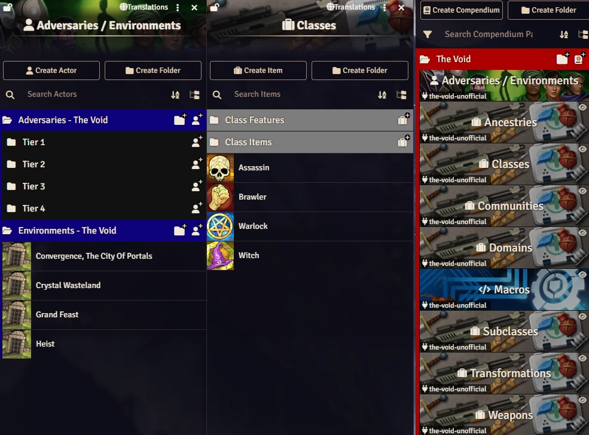

# Daggerheart - The Void (Unofficial)
This module is not official. This is a fanmade work.

The content in this module is from [https://www.daggerheart.com/thevoid/](https://www.daggerheart.com/thevoid/).

<p align="center">
  
</p>

# Manual Instalation
Go to **modules** and paste the link. 
Link: https://raw.githubusercontent.com/brunocalado/the-void-unofficial/main/module.json

# Changelog
You can read about changes at [CHANGELOG](CHANGELOG.md)

# License
The material is not included in the SRD but is included in the License and can be shared. 
```
Daggerheart is a trademark of Darrington Press LLC. All original content, mechanics, and intellectual property related to the Daggerheart roleplaying game are © Darrington Press LLC.This project is intended for personal or non-commercial use. All rights to Daggerheart’s original materials remain with their respective owners.
```

```
For Playtest Materials, no commercial products are permitted in any format, regardless of whether it is a Permitted Format identified above or some other format.
```
Read more at [https://darringtonpress.com/license/](https://darringtonpress.com/license/)