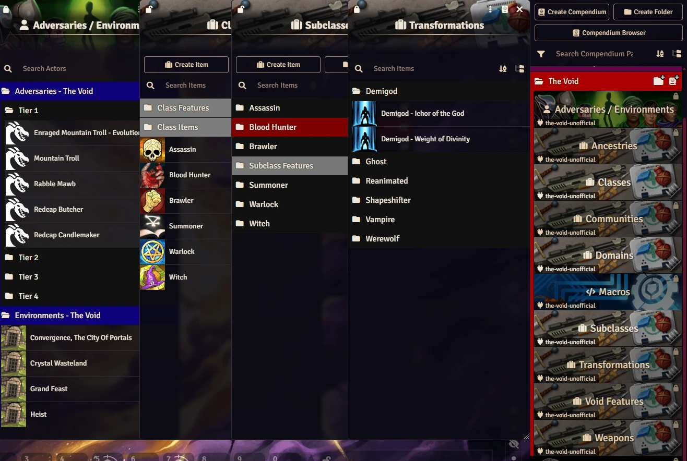

# Void for Daggerheart

This module is not official. This is a fanmade work.

The content in this module is from [https://www.daggerheart.com/thevoid/](https://www.daggerheart.com/thevoid/).

<p align="center">
  
</p>

[](https://buymeacoffee.com/mestredigital) [](https://mestredigital.online/pages/projetos-en)

# Manual Instalation

Go to **modules** and paste the link. 

```js
https://raw.githubusercontent.com/brunocalado/the-void-unofficial/main/module.json
```

# Commands

The module exposes a few commands on the global `Void` object. Call them from a macro or from the console.

| Command | Description |
| :--- | :--- |
| `Void.DomainCards("Lifeblood Talisman")` | Runs the effect registered for a domain card. Each card does its own thing — *Lifeblood Talisman* posts a chat card with the talisman, which any player can drag onto their character sheet. |
| `Void.ComboStrikes()` | Rolls the Brawler's Combo Strike: pick a die, keep rolling while each result is equal to or higher than the last, and post the total damage to chat. |
| `Void.WarlockFavor()` | Recharges the Warlock's Favor Spheres. |

# Changelog

You can read about changes at [CHANGELOG](CHANGELOG.md)

# License

- Dread: https://unsplash.com/pt-br/fotografias/uma-foto-em-preto-e-branco-de-um-cranio-humano-1PtM6b85sdw
- Blood: https://unsplash.com/pt-br/fotografias/a-mao-de-uma-pessoa-com-sangue-nela-9KF7A8PJFF8
- Summoner: https://unsplash.com/pt-br/fotografias/um-logotipo-vermelho-e-branco-kqdl9njdrvs

The material is not included in the SRD but is included in the License and can be shared. 
```
Daggerheart is a trademark of Darrington Press LLC. All original content, mechanics, and intellectual property related to the Daggerheart roleplaying game are © Darrington Press LLC.This project is intended for personal or non-commercial use. All rights to Daggerheart’s original materials remain with their respective owners.
```

```
For Playtest Materials, no commercial products are permitted in any format, regardless of whether it is a Permitted Format identified above or some other format.
```
Read more at [https://darringtonpress.com/license/](https://darringtonpress.com/license/)

# 🧰 My Daggerheart Modules

| Module | Description |
| :--- | :--- |
| 💀 [**Adversary Manager**](https://github.com/brunocalado/daggerheart-advmanager) | Scale adversaries instantly and build balanced encounters in Foundry VTT. |
| 🌟 [**Best Modules**](https://github.com/brunocalado/dh-best-modules) | A curated collection of essential modules to enhance the Daggerheart experience. |
| 🐉 [**Colossus**](https://github.com/brunocalado/dh-colossus) | Manage massive multi-part boss encounters with independent HP per part and a single shared stress pool. |
| 💥 [**Critical**](https://github.com/brunocalado/daggerheart-critical) | Animated Critical. |
| 💠 [**Custom Stat Tracker**](https://github.com/brunocalado/dh-new-stat-tracker) | Add custom trackers to actors. |
| ☠️ [**Death Moves**](https://github.com/brunocalado/daggerheart-death-moves) | Enhances the Death Move moment with a dramatic interface and full automation. |
| 📏 [**Distances**](https://github.com/brunocalado/daggerheart-distances) | Visualizes combat ranges with customizable rings and hover calculations. |
| 📦 [**Extra Content**](https://github.com/brunocalado/daggerheart-extra-content) | Homebrew for Daggerheart. |
| 🤖 [**Resource Macros**](https://github.com/brunocalado/daggerheart-fear-macros) | Automatically executes macros when the Fear or Hope resources are changed. |
| 😱 [**Fear Tracker**](https://github.com/brunocalado/daggerheart-fear-tracker) | Adds an animated slider bar with configurable fear tokens to the UI. |
| 🧟 [**Horde**](https://github.com/brunocalado/dh-horde) | Explode single horde tokens into dozens of individual tokens and manage their movement and stats automatically. |
| 🎁 [**Mystery Box**](https://github.com/brunocalado/dh-mystery-box) | Introduces mystery box mechanics for random loot and surprises. |
| ⚡ [**Quick Actions**](https://github.com/brunocalado/daggerheart-quickactions) | Quick access to common mechanics like Falling Damage, Downtime, etc. |
| 📜 [**Quick Rules**](https://github.com/brunocalado/daggerheart-quickrules) | Fast and accessible reference guide for the core rules. |
| 🎲 [**Stats**](https://github.com/brunocalado/daggerheart-stats) | Tracks dice rolls from GM and Players. |
| 🧠 [**Stats Toolbox**](https://github.com/brunocalado/dh-statblock-importer) | Import using a statblock. |
| 🛒 [**Store**](https://github.com/brunocalado/daggerheart-store) | A dynamic, interactive, and fully configurable store for Foundry VTT. |
| 🔍 [**Unidentified**](https://github.com/brunocalado/dh-unidentified) | Obfuscates item names and descriptions until they are identified by the players. |

# 🗺️ Adventures

| Adventure | Description |
| :--- | :--- |
| ✨ [**I Wish**](https://github.com/brunocalado/i-wish-daggerheart-adventure) | A wealthy merchant is cursed; one final expedition may be the only hope. |
| 💣 [**Suicide Squad**](https://github.com/brunocalado/suicide-squad-daggerheart-adventure) | Criminals forced to serve a ruthless master in a land on the brink of war. |